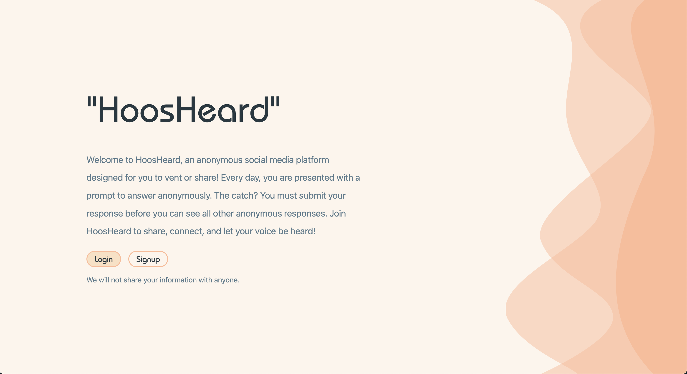

# HoosHeard

Welcome to HoosHeard, an anonymous social media platform designed to help your voice be heard! Every day, you are presented with a thought-provoking question to answer. The catch? You must submit your response before you can see all other anonymous responses. Join HoosHeard to share, connect, and be heard!

Click below to watch the demo!

## Features

- **Daily Refreshed Questions:** Engage with a newly refreshed question every day.
- **Moderated Responses and Comments:** Utilizing OpenAI for content moderation to ensure a safe and respectful environment.
- **Authentication:** Users are authenticated to prevent them from viewing responses before submitting their own.
- **Infinite Scrolling:** Enhances performance by loading responses and comments dynamically.

## Technologies

- **Frontend:** React, Bootstrap
- **Backend:** Node,js, Express, Axios
- **Database/APIs:** MongoDB, OpenAI, Google OAuth 2.0
- **Hosting:** Heroku

## Contributing

Contributions are welcome! Feel free to open issues or pull requests for any features or improvements you'd like to see.

## License

This project is licensed under the [MIT License](LICENSE).
